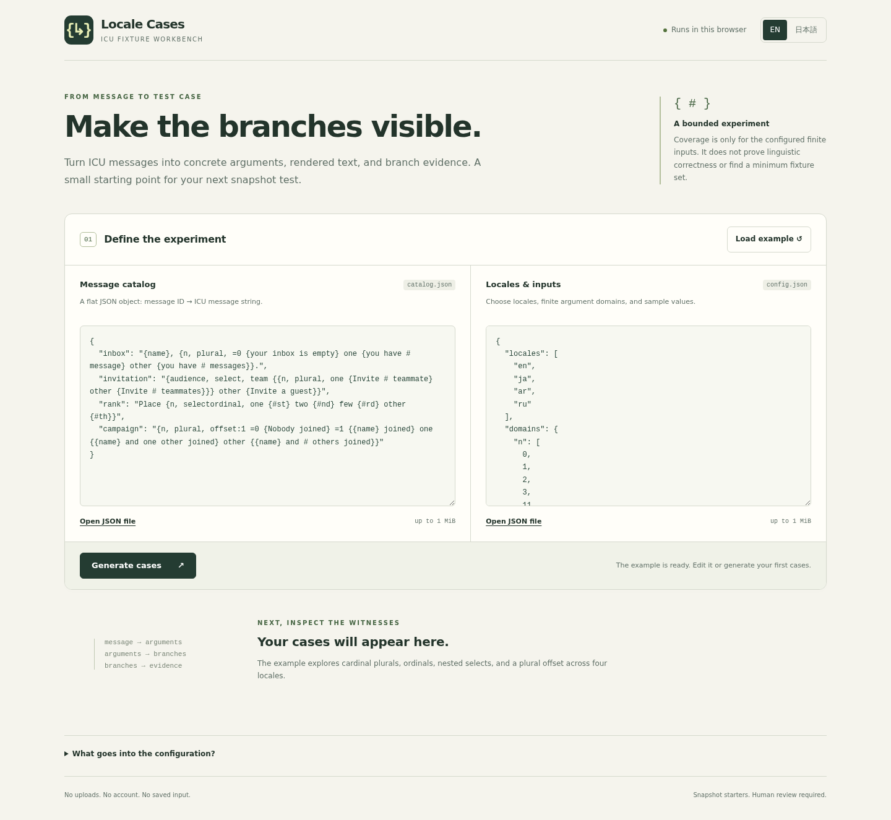

# Locale Cases

Concrete ICU MessageFormat examples for the branches you rarely put in a test.

A local Node CLI and bilingual English/Japanese browser workbench. Give it a flat message catalog, explicit locales and finite argument domains. It exports a compact set of argument assignments, their actual rendered text, and the branch arms each assignment visited. Both interfaces use the same core and pinned FormatJS parser/runtime.

**Coverage is only within the listed finite domains.** “Unobserved” never means globally unreachable. The output is a **snapshot starter**, not proof of translation correctness. The greedy reduction is deterministic, not guaranteed minimum. It covers branch arms, not every path, argument value or distinct rendered string.

## Preview



[Japanese mobile branch ledger](docs/screenshots/mobile-390-japanese-coverage.png) · [Recorded CI and screenshot evidence](docs/VERIFICATION.md)

## Try it locally

Requires Node 22 or 24 with full ICU. Installation/build fetch packages from npm; after that, catalog processing runs locally without network requests, uploads, telemetry or persistence.

```sh
npm ci --ignore-scripts
npm test
node src/cli.js --catalog fixtures/messages.json --config fixtures/config.json --out out
```

`out` must not exist, even as an empty directory. The CLI creates `cases.json` and `coverage.json`. Source/config files stay unchanged. Parsing, resource checks and fixture generation finish before output creation; validation/budget errors leave no output. Ordinary write failures trigger cleanup. A process crash or power loss during the two file writes is not a filesystem transaction; remove an incomplete output directory yourself before retrying.

For the browser workbench:

```sh
npm run build
npm run serve
```

Open **http://127.0.0.1:4173** in your browser. The server binds only to loopback. Keep the terminal open; stop it with Ctrl+C. The browser UI uses a disposable worker and can cancel a run. Edits invalidate old results and downloads. No CDN, cloud service or account is required. Do not open `index.html` directly as a `file:` URL.

## Input contract

Catalog (`messages.json`):

```json
{
  "cart.items": "{n, plural, =0 {Empty} one {One item} other {# items}}",
  "greeting": "Hello {name}"
}
```

Configuration (`config.json`):

```json
{
  "locales": ["en", "ja", "ar", "ru"],
  "domains": {"n": [0, 1, 2, 3, 11, 100, 0.1]},
  "samples": {"name": "Aki"}
}
```

- Locales are required, canonicalized, deduplicated and sorted. Unsupported locales fail instead of silently accepting the runtime's default locale
- Domains are nonempty, same-type arrays of strings or finite numbers with absolute value at most `Number.MAX_SAFE_INTEGER`. Duplicates are removed; first-occurrence order provides deterministic tie-breaking
- Samples are single strings or safe finite numbers. A placeholder with no selectors requires a sample or domain. If its name has selectors elsewhere in the catalog, it inherits that global type/default domain
- Argument names have one type across the catalog: string for `select`, number for `plural`/`selectordinal`. Plain references may share those names. String/numeric conflicts fail
- Unknown configuration keys/arguments, duplicate JSON keys, unpaired UTF-16 surrogates, objects/booleans/null as values, unsafe numbers and prototype-related argument identifiers fail explicitly
- Without a numeric domain, defaults include 0–200, selected fractions, 1,000, 1,000,000, exact-selector values, and offset neighbors. String defaults include named select options and a collision-free fallback. Every actual value and representative is in `coverage.json`; defaults are samples, not a universal locale theorem
- Global argument domains use selector sites across the whole catalog. Assignments stay consistent at all nested and sibling uses of a name

Supported: MF1 literals, simple arguments, `select`, `plural`, `selectordinal`, exact selectors, offsets, apostrophe escaping and `#`. Rejected: number/date/time formatting (including styles/skeletons), rich-text tags, custom functions and MF2 syntax. Quoted literal HTML is text. Locale changes plural/number behavior; this tool does **not** translate the catalog text.

## What comes out

`cases.json` contains `cases[]` with `id`, `messageId`, `locale`, `args`, `text`, and actual `branches[]`.

`coverage.json` contains the resolved locale, listed original domains and reduced representatives, all syntactic arms, observed/unobserved IDs, and evaluated representative-vector counts per message/locale. A successful report has `complete: true`; this means the finite-domain analysis completed, even when some syntactic arms are unobserved. Failures return no coverage report.

Both exports contain SHA-256 digests of the exact input texts, tool/dependency versions, limits and runtime metadata. Node records Node/V8/ICU/CLDR/Unicode versions. Browsers do not expose ICU/CLDR versions and say so. Byte determinism is promised only for the same source/config bytes, tool and runtime; different engines or ICU releases can format differently.

Replay an exported case with the pinned runtime:

```js
import { readFile } from 'node:fs/promises';
import IntlMessageFormat from 'intl-messageformat';
const catalog = JSON.parse(await readFile('fixtures/messages.json', 'utf8'));
const { cases } = JSON.parse(await readFile('out/cases.json', 'utf8'));
for (const c of cases) {
  const actual = new IntlMessageFormat(catalog[c.messageId], c.locale).format(c.args);
  if (actual !== c.text) throw new Error(`Snapshot differs: ${c.id}`);
}
```

Review the starter text before adopting it as an expected result. The same runtime generating and replaying text is useful reproducibility evidence, not an independent linguistic oracle.

## Resource bounds and failure behavior

Defaults: 1 MiB per JSON input, 16 KiB/message, 1 KiB/message ID, 200 messages, 8 locales, 32 AST nesting levels, 2,000 AST elements **plus option arms**/message, 32 arguments/message, 512 values/domain, 4 KiB/string value, 10,000 representative vectors/message/locale, 100,000/run, 2,000,000 work units, 256 KiB/rendered-text upper bound, 8 MiB combined exports. A conservative 64-level raw-brace guard runs before the parser, including quoted braces; JSON nesting is limited to 40.

Config `limits` may only lower these constants. Very long branch paths can fail the early static-metadata output budget. A budget failure is visibly incomplete and exports nothing; it is never a coverage pass. See [algorithm and limits](docs/ALGORITHM.md).

## Verification and project scope

```sh
npm test
npm run check:syntax
npm run build
npm run benchmark
# Dedicated sandbox-capable machine / CI only:
npx playwright install --with-deps chromium
npm run test:browser
```

The independent test oracle injects markers into FormatJS AST branches and exhaustively evaluates small original domains through `intl-messageformat`, then compares selected trace IDs and branch unions. It does not use this tool's tracer to decide expected coverage.

See [verification status](docs/VERIFICATION.md), [synthetic benchmark](docs/benchmark.json), [prior art](docs/PRIOR_ART.md), [security](docs/SECURITY.md) and [dependency notices](docs/THIRD_PARTY.md). This is a portfolio-scale developer utility; user demand and commercial value have not been validated. No project license is granted in this repository; third-party licenses remain their owners' terms.

## 日本語

ICU MessageFormat の分岐を通る具体的な引数と表示結果を、手元の JSON から作る小さな開発ツールです。ブラウザー画面は日本語／英語を切り替えられます。CLI と同じコアを Web Worker 内で実行し、入力変更やキャンセル後の古い結果は使えません。

カバレッジの対象は、出力に列挙した有限の値域だけです。「未観測」は「どんな入力でも到達不能」という意味ではありません。生成結果はスナップショットテストのたたき台であり、翻訳の正しさ、全経路網羅、最小ケース数を保証しません。英語の入力文が他の言語に翻訳されることもありません。上限を超える入力は、不完全な結果を成功として出さずに停止します。
